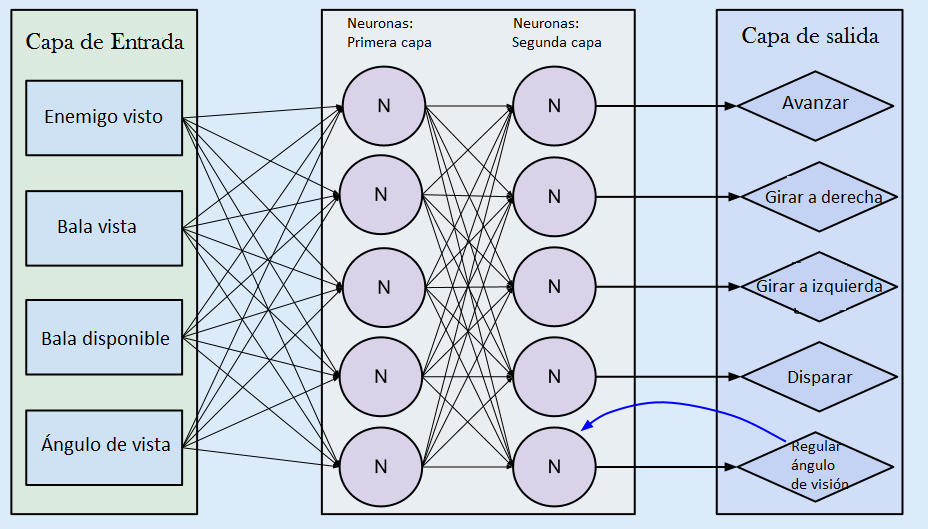
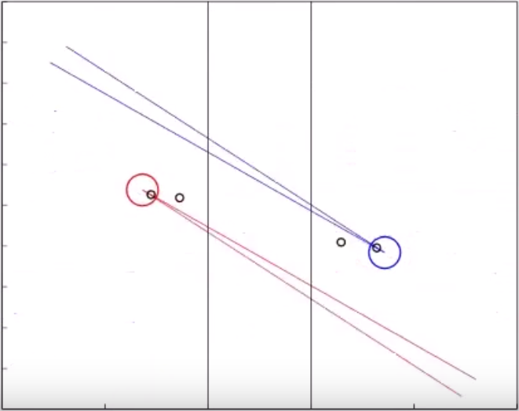
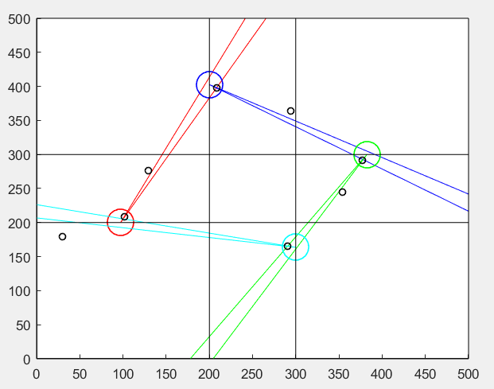

# Genetic fighters

In this repo, we develop a little game in which each player learn itself how to play. To do that, we train a neural network (nn) using a genetic algorithm.

Each player use a nn with two layers and 5 neurons each layer as the controller. 

The inputs of the nn are:

* Enemy seen
* Bullet seen
* Bullet available
* Angle of view

And the outputs are:

* Go forward
* Turn right
* Turn left
* Shoot bullet
* Change angle of view

So the net ends something like:

<p align="center">
  
</p>

We use a genetic algorithm (GA) to train the players, so the population of the GA are the players of the game. The ones that get best score will live more iterations than the ones with lowest score.
Also, the best players are used to generate the next generation of players. 

## Getting Started

All the code has been done and test with Matlab 2016a.

## Running the tests

The code is split in two folders with the same structure: 

* [AlgGen2p](src/AlgGen2p): with two players each match.

<p align="center">
  
</p>


* [AlgGen4p](src/AlgGen4p): with four players each match.

<p align="center">
  
</p>

Once you enter in the folder, to run the learning you have to execute:

```
Game
```

To modify the learning population and the number of generations of the learning, you can change the parameters 'fighters' and 'generations' in the Game.m code.

When the GA finish their training, you can watch any of the match of any of the generation executing:

```
Last_gen
```

To modify the match displayed, change the 'generation' and 'match' parameter.


## Authors

* **Julio López Paneque** - [JulioLP](https://github.com/JulioLP)
* **Gonzalo Mier** - [Gonmiermu](https://github.com/Gonmiermu)

## License

This project is licensed under the MIT License - see the [LICENSE.md](LICENSE.md) file for details

## Acknowledgments

* The video with the results can be seen in [video](https://www.youtube.com/watch?v=DhVx0OX-0EM)
* The original idea was from this [video](https://www.youtube.com/watch?v=u2t77mQmJiY)

## To-do list

* Recode the full code
* Improve the learning of the GA
* Try new NNs
* Change the image from spanish to english

